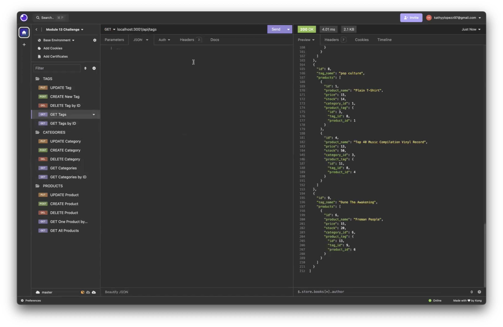

# ORM-E-Commerce-Back-End

[](https://opensource.org/licenses/MIT)

  
## Overview of ORM -E-Commerce-Back-End

## User Story
```
AS A manager at an internet retail company
I WANT a back end for my e-commerce website that uses the latest technologies
SO THAT my company can compete with other e-commerce companies


```

## Acceptance Criteria
```
GIVEN a functional Express.js API
WHEN I add my database name, MySQL username, and MySQL password to an environment variable file
THEN I am able to connect to a database using Sequelize
WHEN I enter schema and seed commands
THEN a development database is created and is seeded with test data
WHEN I enter the command to invoke the application
THEN my server is started and the Sequelize models are synced to the MySQL database
WHEN I open API GET routes in Insomnia for categories, products, or tags
THEN the data for each of these routes is displayed in a formatted JSON
WHEN I test API POST, PUT, and DELETE routes in Insomnia
THEN I am able to successfully create, update, and delete data in my database

```
## Table of Contents

- [Description](#description)
- [Links](#links)
- [Installation](#installation)
- [Usage](#usage)
- [Credits](#credits)
- [Contact me](#contact-me)


  
## Description
Overview of E-Commerce-Back-End is to use MYSQL , Express.js and Sequelize to store data using dotenv packages. 
Thus, creating a a backend e-commerce to follow the latest technologies in a website. 
## Links
- [The URL of Github Repository](https://github.com/kathylopez97/ORM-E-Commerce-Back-End)
- [Youtube Video Walkthrough](https://www.youtube.com/watch?v=I0INVz0rd0M)

## Installation 

Instructions on how to use the ORM -E-Commerce-Back-End


1. Clone the repo
   ```
   git clone git@github.com:kathylopez97/ORM-E-Commerce-Back-End.git
   ```
2. Install NPM packages

   ```
   npm i 
   ```

3. To run ORM E-Commerce-Back-End, 

    Use MYSQL 
   ```
   my sql -u root -p
   ```
4. Enter your SQL Password,
   ```
    use ecommerce_db;
   ```
   ```
   source db/schema.sql;
   ```
   ``` 
   exit
5. Run Server
   ```
   npm run seed 
   ```
   ```
   node server.js
   ```
6. Use Insomina 
## Usage 

## Credits 
- Youtube: [Youtube](https://youtube.com)
- Visual Studio Code: [VS Code](https://code.visualstudio.com/)
- Professional README Guide: [README.md](https://coding-boot-camp.github.io/full-stack/github/professional-readme-guide)
- Professional  Video Guide Submisson: [VideoGuide](https://coding-boot-camp.github.io/full-stack/computer-literacy/video-submission-guide)


## Contact me
<!-- I hope you all like it! -->


Contact me If you have any questions or additional feedback.
- [Github](https://github.com/kathylopez97)
- [Email](kathyylopezz97@gmail.com)
